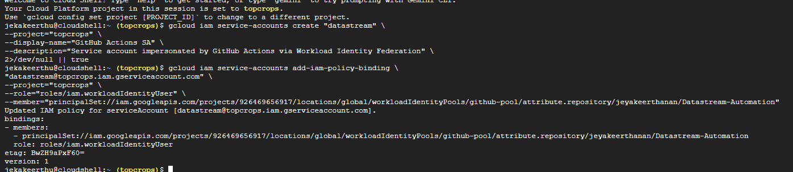
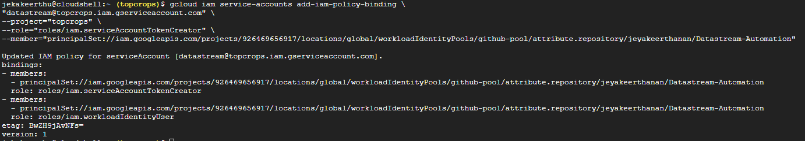
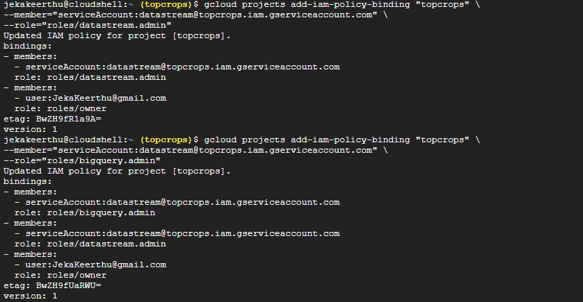
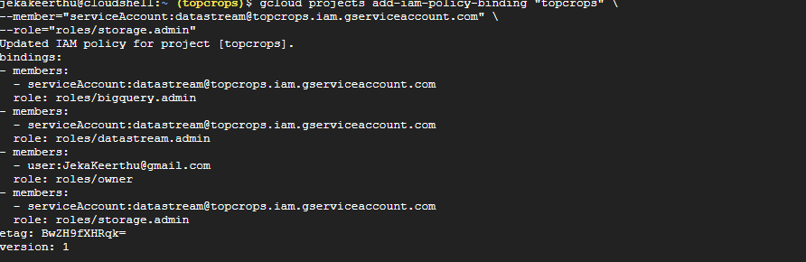
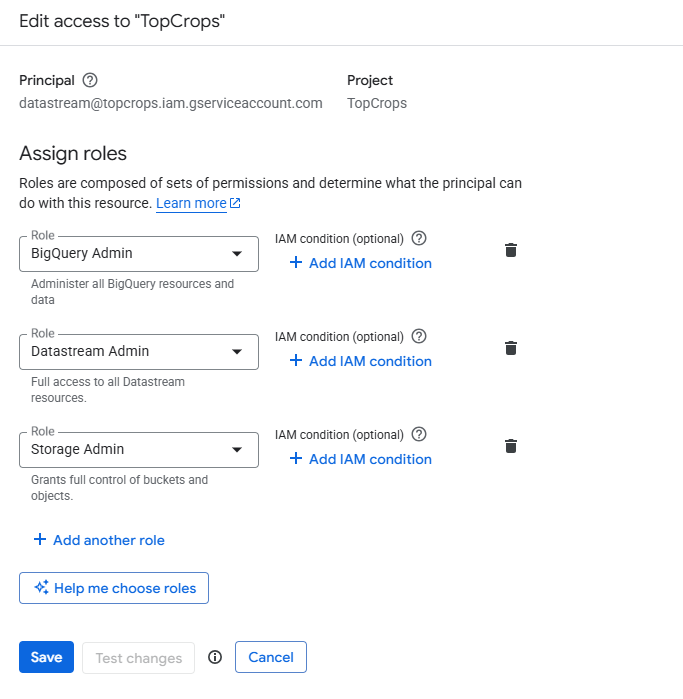
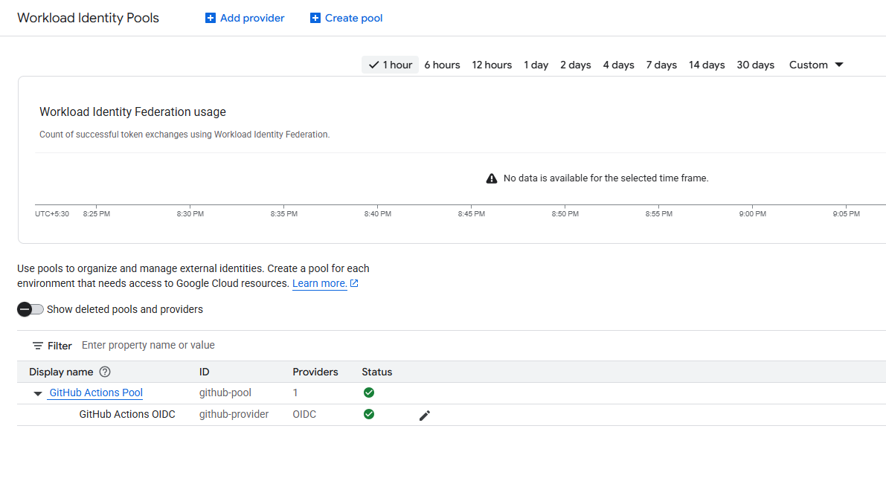
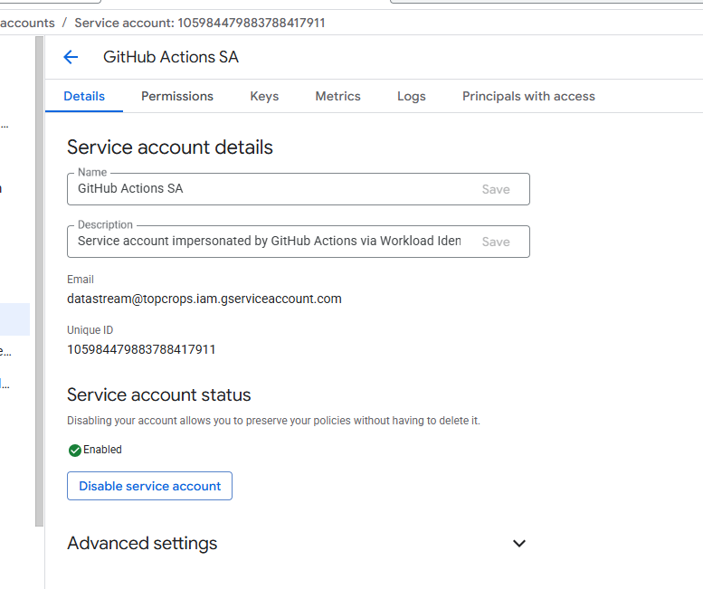

WIF Creation
================
gcloud iam workload-identity-pools create "${POOL_ID}" \
--project="${PROJECT_ID}" \
--location="global" \
--display-name="GitHub Pool" \
--description="Workload Identity Pool for GitHub Actions"

gcloud iam workload-identity-pools create github-pool \
--project=topcrops \
--location=global \
--display-name="GitHub Actions Pool"

provider creation
=======================
gcloud iam workload-identity-pools providers create-oidc "${PROVIDER_ID}" \
--project="${PROJECT_ID}" \
--location="global" \
--workload-identity-pool="${POOL_ID}" \
--display-name="GitHub Actions OIDC" \
--issuer-uri="https://token.actions.githubusercontent.com" \
--attribute-mapping="google.subject=assertion.sub,attribute.repository=assertion.repository,attribute.ref=assertion.ref,attribute.actor=assertion.actor" \
--attribute-condition="assertion.repository=='${GITHUB_OWNER}/${GITHUB_REPO}' && assertion.ref=='refs/heads/${GITHUB_BRANCH}'"

gcloud iam workload-identity-pools providers create-oidc "github-provider" \
--project="topcrops" \
--location="global" \
--workload-identity-pool="github-pool" \
--display-name="GitHub Actions OIDC" \
--issuer-uri="https://token.actions.githubusercontent.com" \
--attribute-mapping="google.subject=assertion.sub,attribute.repository=assertion.repository,attribute.ref=assertion.ref,attribute.actor=assertion.actor" \
--attribute-condition="assertion.repository=='jeyakeerthanan/Datastream-Automation' && assertion.ref=='refs/heads/master'"

service account
===============

gcloud iam service-accounts create "datastream" \
--project="topcrops" \
--display-name="GitHub Actions SA" \
--description="Service account impersonated by GitHub Actions via Workload Identity Federation" \
2>/dev/null || true

Allow GitHub identities to impersonate the service account
===============================================================
gcloud iam service-accounts add-iam-policy-binding \
"datastream@topcrops.iam.gserviceaccount.com" \
--project="topcrops" \
--role="roles/iam.workloadIdentityUser" \
--member="principalSet://iam.googleapis.com/projects/926469656917/locations/global/workloadIdentityPools/github-pool/attribute.repository/jeyakeerthanan/Datastream-Automation"

If your workflow needs to mint access tokens (some tooling does), add:
============================================================================
gcloud iam service-accounts add-iam-policy-binding \
"datastream@topcrops.iam.gserviceaccount.com" \
--project="topcrops" \
--role="roles/iam.serviceAccountTokenCreator" \
--member="principalSet://iam.googleapis.com/projects/926469656917/locations/global/workloadIdentityPools/github-pool/attribute.repository/jeyakeerthanan/Datastream-Automation"
 

# Minimal-ish roles for Terraform to manage Datastream and use state bucket.
gcloud projects add-iam-policy-binding "topcrops" \
--member="serviceAccount:datastream@topcrops.iam.gserviceaccount.com" \
--role="roles/datastream.admin"

gcloud projects add-iam-policy-binding "topcrops" \
--member="serviceAccount:datastream@topcrops.iam.gserviceaccount.com" \
--role="roles/bigquery.admin"

gcloud projects add-iam-policy-binding "topcrops" \
--member="serviceAccount:datastream@topcrops.iam.gserviceaccount.com" \
--role="roles/storage.admin"

 